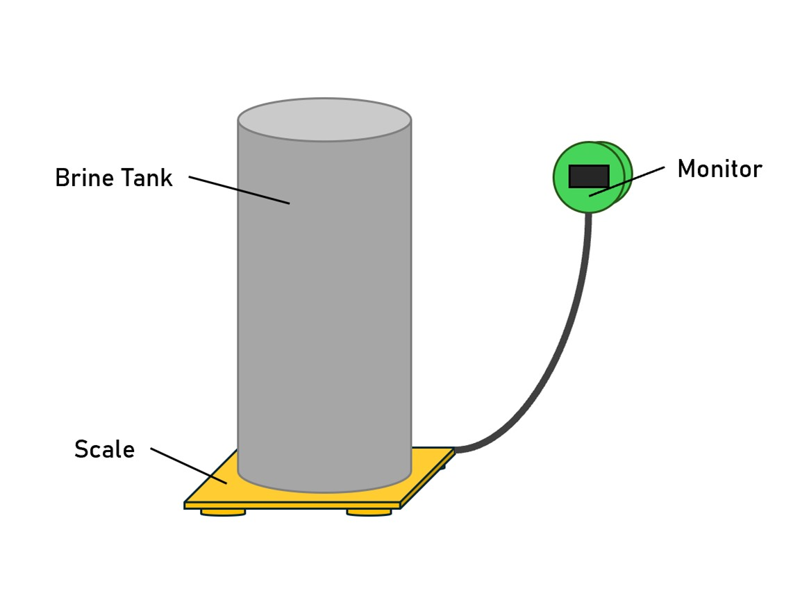
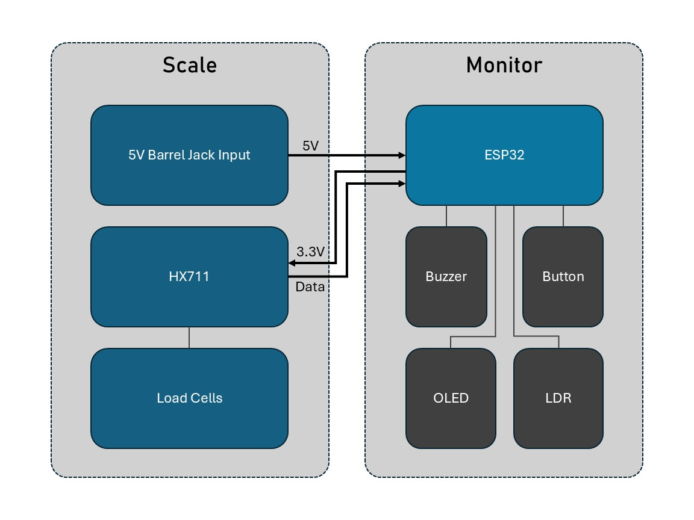

# SaltScale

A compact, inexpensive monitor that uses a repurposed bathroom scale, HX711 amplifier, and ESP32 to measure salt in a water softener’s brine tank and provide alerts when salt levels are low.

##  Architecture Overview

##  System Components & Responsibilities

### 1. **Scale Unit**
- **Purpose:** Sits beneath the brine tank to measure total salt weight.
- **Key Design Choices:**
  - Utilizes an old bathroom scale: budget-friendly, durable, non-invasive.
  - HX711 amplifier is mounted **inside**—minimizes analog noise over cable runs.
  - Load cells arranged in a Wheatstone bridge (front-left + rear-right, front-right + rear-left) for balanced readings.

### 2. **Communication & Power Harness**
- A single **Ethernet cable** carries:
  - **5 V supply** (input at scale via DC barrel jack).
  - **3.3 V power** (regulated by ESP32) fed down to HX711.
  - **HX711 data lines** (SCK, DT) and ground.
- **Advantages:**
  - Clean, tidy, modular wiring.
  - Consolidated power input at the scale simplifies cable management.

### 3. **Monitor Unit**
- Hosted in a 3D-printed enclosure with magnetic mounting to the resin tank.
- Contains:
  - **ESP32 microcontroller** – handles data processing and logic.
  - **OLED display** – shows salt weight continuously.
  - **Buzzer** – emits periodic beeps when salt weight drops below ~25 lb (configurable alert threshold).
  - **Pushbutton** – initiates calibration routines on demand.
  - **LDR (light-dependent resistor)** – turns off the display in low-light for power saving and burn-in prevention.

##  Future Extensions (Possible Enhancements)
- Adding **wireless connectivity** (e.g., Wi-Fi, Bluetooth) to enable remote salt level alerts (e.g., via Telegram, email).
- Logging salt usage trends over time to predict refill needs.
- Customizing alert thresholds or adding smartphone integration.

##  Links & Resources

- **Instructables Guide:** [Detailed build walkthrough and steps](https://www.instructables.com/Water-Softner-Salt-Meter-Using-a-Bathroom-Scale/)
- **Source Firmware:** `SaltScale_V2.ino`
